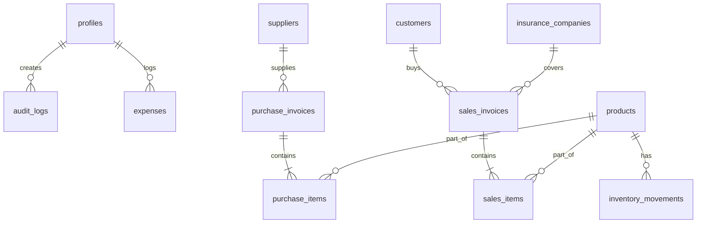

# Database Design & Schema — Revo Pharmacy Management System

This document outlines the PostgreSQL database schema for Revo on Supabase. In accordance with the Project Constitution, UUIDs are used for all primary keys, timestamps are automatically managed, and Row-Level Security (RLS) is enforced.

---

## 1. Entity Relationship Overview



---

## 2. Table Schemas

### `profiles` (User Accounts & Roles)
Stores system users and their assigned roles.

```sql
CREATE TABLE public.profiles (
    id UUID REFERENCES auth.users ON DELETE CASCADE PRIMARY KEY,
    username TEXT UNIQUE NOT NULL,
    full_name TEXT NOT NULL,
    role TEXT NOT NULL CHECK (role IN ('Owner', 'Manager', 'Pharmacist', 'Cashier', 'Accountant')),
    created_at TIMESTAMP WITH TIME ZONE DEFAULT TIMEZONE('utc'::text, NOW()) NOT NULL,
    updated_at TIMESTAMP WITH TIME ZONE DEFAULT TIMEZONE('utc'::text, NOW()) NOT NULL,
    deleted_at TIMESTAMP WITH TIME ZONE
);
```

### `suppliers`
Tracks manufacturers and wholesale suppliers.

```sql
CREATE TABLE public.suppliers (
    id UUID PRIMARY KEY DEFAULT gen_random_uuid(),
    name TEXT NOT NULL,
    contact_phone TEXT,
    email TEXT,
    address TEXT,
    balance NUMERIC(15, 2) DEFAULT 0.00 NOT NULL, -- Supplier account balance
    created_at TIMESTAMP WITH TIME ZONE DEFAULT TIMEZONE('utc'::text, NOW()) NOT NULL,
    updated_at TIMESTAMP WITH TIME ZONE DEFAULT TIMEZONE('utc'::text, NOW()) NOT NULL,
    deleted_at TIMESTAMP WITH TIME ZONE
);
```

### `products`
The main inventory catalog of medicines and goods.

```sql
CREATE TABLE public.products (
    id UUID PRIMARY KEY DEFAULT gen_random_uuid(),
    trade_name TEXT NOT NULL,
    scientific_name TEXT,
    barcode TEXT UNIQUE,
    category TEXT,
    purchase_price NUMERIC(15, 2) NOT NULL,
    selling_price NUMERIC(15, 2) NOT NULL,
    expiry_date DATE NOT NULL,
    min_stock INTEGER DEFAULT 10 NOT NULL,
    
    -- Unit conversion rules (e.g., Box to Strip, Strip to Piece)
    unit_name_primary TEXT NOT NULL, -- e.g., 'Box'
    unit_name_secondary TEXT,        -- e.g., 'Strip'
    unit_name_tertiary TEXT,         -- e.g., 'Piece'
    conversion_rate_1 INTEGER,       -- how many secondary units in primary (e.g., 3 strips in a box)
    conversion_rate_2 INTEGER,       -- how many tertiary units in secondary (e.g., 10 pieces in a strip)
    
    -- Stock counts (tracked in the lowest unit tier, e.g., Piece count)
    stock_qty_lowest_unit INTEGER DEFAULT 0 NOT NULL,
    
    created_at TIMESTAMP WITH TIME ZONE DEFAULT TIMEZONE('utc'::text, NOW()) NOT NULL,
    updated_at TIMESTAMP WITH TIME ZONE DEFAULT TIMEZONE('utc'::text, NOW()) NOT NULL,
    deleted_at TIMESTAMP WITH TIME ZONE
);
```

### `inventory_movements`
Tracks audit trail of stock adjustments.

```sql
CREATE TABLE public.inventory_movements (
    id UUID PRIMARY KEY DEFAULT gen_random_uuid(),
    product_id UUID REFERENCES public.products(id) ON DELETE RESTRICT NOT NULL,
    qty_change INTEGER NOT NULL, -- positive for addition, negative for deduction
    movement_type TEXT NOT NULL CHECK (movement_type IN ('Sale', 'Purchase', 'Return', 'Adjustment', 'Disposal')),
    reference_id UUID,           -- links to sales_invoice_id, purchase_invoice_id, etc.
    actor_id UUID REFERENCES public.profiles(id) NOT NULL,
    notes TEXT,
    created_at TIMESTAMP WITH TIME ZONE DEFAULT TIMEZONE('utc'::text, NOW()) NOT NULL
);
```

### `customers`
Tracks retail, recurring, and insured customers.

```sql
CREATE TABLE public.customers (
    id UUID PRIMARY KEY DEFAULT gen_random_uuid(),
    name TEXT NOT NULL,
    phone TEXT,
    is_recurring BOOLEAN DEFAULT false NOT NULL,
    insurance_policy_no TEXT,
    insurance_company_id UUID, -- References insurance_companies(id)
    credit_limit NUMERIC(15, 2) DEFAULT 0.00 NOT NULL,
    current_debt NUMERIC(15, 2) DEFAULT 0.00 NOT NULL,
    created_at TIMESTAMP WITH TIME ZONE DEFAULT TIMEZONE('utc'::text, NOW()) NOT NULL,
    updated_at TIMESTAMP WITH TIME ZONE DEFAULT TIMEZONE('utc'::text, NOW()) NOT NULL,
    deleted_at TIMESTAMP WITH TIME ZONE
);
```

### `insurance_companies`
Manages contracted insurance networks.

```sql
CREATE TABLE public.insurance_companies (
    id UUID PRIMARY KEY DEFAULT gen_random_uuid(),
    name TEXT NOT NULL,
    copay_percentage NUMERIC(5, 2) NOT NULL, -- e.g., 15.00 for 15% patient co-pay
    max_coverage NUMERIC(15, 2),
    created_at TIMESTAMP WITH TIME ZONE DEFAULT TIMEZONE('utc'::text, NOW()) NOT NULL,
    updated_at TIMESTAMP WITH TIME ZONE DEFAULT TIMEZONE('utc'::text, NOW()) NOT NULL,
    deleted_at TIMESTAMP WITH TIME ZONE
);
```

### `sales_invoices`
Sales transactions recorded at POS.

```sql
CREATE TABLE public.sales_invoices (
    id UUID PRIMARY KEY DEFAULT gen_random_uuid(),
    invoice_no TEXT UNIQUE NOT NULL,
    cashier_id UUID REFERENCES public.profiles(id) NOT NULL,
    customer_id UUID REFERENCES public.customers(id),
    insurance_company_id UUID REFERENCES public.insurance_companies(id),
    
    total_amount NUMERIC(15, 2) NOT NULL,         -- Gross total
    discount NUMERIC(15, 2) DEFAULT 0.00 NOT NULL,
    insurance_coverage NUMERIC(15, 2) DEFAULT 0.00 NOT NULL,
    patient_copay NUMERIC(15, 2) NOT NULL,        -- Amount patient must pay
    
    payment_type TEXT NOT NULL CHECK (payment_type IN ('Cash', 'Card', 'Debt', 'Split')),
    amount_paid_cash NUMERIC(15, 2) DEFAULT 0.00 NOT NULL,
    amount_paid_card NUMERIC(15, 2) DEFAULT 0.00 NOT NULL,
    
    created_at TIMESTAMP WITH TIME ZONE DEFAULT TIMEZONE('utc'::text, NOW()) NOT NULL,
    deleted_at TIMESTAMP WITH TIME ZONE
);
```

### `sales_items`
Line items inside sales invoices.

```sql
CREATE TABLE public.sales_items (
    id UUID PRIMARY KEY DEFAULT gen_random_uuid(),
    sales_invoice_id UUID REFERENCES public.sales_invoices(id) ON DELETE CASCADE NOT NULL,
    product_id UUID REFERENCES public.products(id) ON DELETE RESTRICT NOT NULL,
    unit_sold TEXT NOT NULL CHECK (unit_sold IN ('Box', 'Strip', 'Piece')),
    qty INTEGER NOT NULL,
    unit_price NUMERIC(15, 2) NOT NULL,
    total_price NUMERIC(15, 2) NOT NULL,
    created_at TIMESTAMP WITH TIME ZONE DEFAULT TIMEZONE('utc'::text, NOW()) NOT NULL
);
```

### `purchase_invoices`
Suppliers' purchase entries.

```sql
CREATE TABLE public.purchase_invoices (
    id UUID PRIMARY KEY DEFAULT gen_random_uuid(),
    invoice_no TEXT NOT NULL,
    supplier_id UUID REFERENCES public.suppliers(id) ON DELETE RESTRICT NOT NULL,
    received_by UUID REFERENCES public.profiles(id) NOT NULL,
    total_amount NUMERIC(15, 2) NOT NULL,
    is_paid BOOLEAN DEFAULT true NOT NULL,
    created_at TIMESTAMP WITH TIME ZONE DEFAULT TIMEZONE('utc'::text, NOW()) NOT NULL,
    updated_at TIMESTAMP WITH TIME ZONE DEFAULT TIMEZONE('utc'::text, NOW()) NOT NULL,
    deleted_at TIMESTAMP WITH TIME ZONE
);
```

### `purchase_items`
Line items inside purchase invoices.

```sql
CREATE TABLE public.purchase_items (
    id UUID PRIMARY KEY DEFAULT gen_random_uuid(),
    purchase_invoice_id UUID REFERENCES public.purchase_invoices(id) ON DELETE CASCADE NOT NULL,
    product_id UUID REFERENCES public.products(id) ON DELETE RESTRICT NOT NULL,
    qty INTEGER NOT NULL,
    unit_purchase_price NUMERIC(15, 2) NOT NULL,
    total_price NUMERIC(15, 2) NOT NULL,
    created_at TIMESTAMP WITH TIME ZONE DEFAULT TIMEZONE('utc'::text, NOW()) NOT NULL
);
```

### `expenses`
Operational expenses ledger.

```sql
CREATE TABLE public.expenses (
    id UUID PRIMARY KEY DEFAULT gen_random_uuid(),
    category TEXT NOT NULL CHECK (category IN ('Rent', 'Electricity', 'Salaries', 'Water', 'Internet', 'Maintenance', 'Other')),
    amount NUMERIC(15, 2) NOT NULL,
    description TEXT,
    logged_by UUID REFERENCES public.profiles(id) NOT NULL,
    created_at TIMESTAMP WITH TIME ZONE DEFAULT TIMEZONE('utc'::text, NOW()) NOT NULL,
    updated_at TIMESTAMP WITH TIME ZONE DEFAULT TIMEZONE('utc'::text, NOW()) NOT NULL,
    deleted_at TIMESTAMP WITH TIME ZONE
);
```

### `audit_logs`
Mandatory event tracking log.

```sql
CREATE TABLE public.audit_logs (
    id UUID PRIMARY KEY DEFAULT gen_random_uuid(),
    actor_id UUID REFERENCES public.profiles(id),
    action TEXT NOT NULL,       -- e.g., 'INSERT', 'UPDATE', 'DELETE'
    target_table TEXT NOT NULL, -- e.g., 'products'
    target_id UUID NOT NULL,
    original_data JSONB,
    new_data JSONB,
    created_at TIMESTAMP WITH TIME ZONE DEFAULT TIMEZONE('utc'::text, NOW()) NOT NULL
);
```

---

## 3. Database Indexes & Query Optimizations

To support rapid product lookup and filtering:
```sql
-- Text index for trade and scientific names (RTL-compatible)
CREATE INDEX idx_products_names ON public.products (trade_name, scientific_name);

-- Unique index on barcode for instant scanning resolver
CREATE INDEX idx_products_barcode ON public.products (barcode);

-- Search index on sales by cashier/invoice number
CREATE INDEX idx_sales_invoice_no ON public.sales_invoices (invoice_no);
```

---

## 4. Row-Level Security (RLS) Policies

All tables will have RLS enabled. Example policies for the `products` table:

- **Anonymous**: Denied all access.
- **Cashier / Pharmacist**: `SELECT` allowed on products. `INSERT`, `UPDATE`, `DELETE` denied.
- **Manager**: `SELECT`, `INSERT`, `UPDATE` allowed. `DELETE` denied.
- **Owner**: All privileges allowed.
