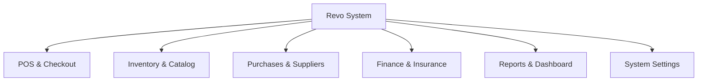

# Product Requirements Document (PRD) — Revo Pharmacy Management System

**Version**: 1.0  
**Date**: 2026-07-05  
**Status**: Draft  
**Author**: Product Manager & System Analyst  

---

## 1. Project Overview

Revo is a modern, fast, and offline-first pharmacy management system specifically optimized for the unique challenges of the Sudanese market (unstable internet, frequent power cuts, inflation-driven price adjustments, and localized insurance systems). Revo functions primarily as a desktop application on Windows (via Electron), backed by a cloud-synchronized backend (via Supabase) for remote management, data aggregation, and backups when internet connectivity is active.

---

## 2. Objectives

- **High Availability**: Core pharmacy workflows (POS sales, stock checks, receipt printing) must continue to function 100% offline.
- **Workflow Efficiency**: Reduce transaction times at the checkout counter to under 30 seconds to prevent customer bottlenecks.
- **Accuracy**: Prevent critical errors like selling expired medication, selling out-of-stock items, or mismatching insurance coverage.
- **Financial Traceability**: Provide comprehensive auditing of sales, purchases, stock adjustments, and supplier balances.

---

## 3. Users

- **Pharmacy Owners**: Require remote business monitoring, high-level financial reports, and margin analysis.
- **Pharmacy Managers**: Manage inventory, configure pricing, handle purchase orders, and audit employees.
- **Pharmacists**: Dispense medication, match scientific/trade names, check inventory levels, and handle insurance claims.
- **Cashiers**: Fast checkout, scanning barcodes, collecting payments, and printing thermal receipts.
- **Accountants**: Manage supplier balances, track expenses, record customer debts, and export ledger-ready reports.

---

## 4. User Roles & Access Control

Revo implements a Role-Based Access Control (RBAC) matrix. The primary roles are:

1. **Owner**: Full access to all settings, financial data, logs, and user configurations.
2. **Manager**: Full operational access (inventory, purchases, suppliers, reports) but restricted from modifying core settings/database configuration.
3. **Pharmacist**: Access to dispensing, product directories, and stock lookup. Can create pending sales/prescriptions.
4. **Cashier**: Access to the POS system, checkout, and receipt printing. Cannot modify product prices or delete transaction history.
5. **Accountant**: Access to financial reports, expenses, supplier/customer debts, and invoicing records.

---

## 5. Functional Requirements

### FR-POS: Point of Sale (POS)
- **FR-POS-001**: The POS interface must support high-speed operation using keyboard shortcuts for all primary actions.
- **FR-POS-002**: ZXing barcode scanner input must instantly resolve products.
- **FR-POS-003**: The cashier must be able to sell in multiple units (Box, Strip, Piece) with automatic stock deduction based on conversion rules.
- **FR-POS-004**: System must block transactions if stock level for any selected item is zero (unless configuration permits overdraft, which is disabled by default in v1).
- **FR-POS-005**: Automatic print triggers for thermal receipts via Electron integration.

### FR-INV: Inventory Management
- **FR-INV-001**: Support scientific name and trade name indexing.
- **FR-INV-002**: Tracking of product expiry dates with warnings at 6 months, 3 months, and block-on-expiry.
- **FR-INV-003**: Low stock alerts triggered automatically when inventory drops below the configured `min_stock` threshold.
- **FR-INV-004**: Record all stock adjustments (spoilage, theft, manual correction) in the audit log.

### FR-PUR: Purchases & Suppliers
- **FR-PUR-001**: Record supplier purchase invoices, auto-calculating average unit cost and updating stock.
- **FR-PUR-002**: Manage supplier credit balances and register payments.
- **FR-PUR-003**: Handle purchase returns (crediting back to supplier balance).

### FR-FIN: Finance & Insurance
- **FR-FIN-001**: Record and categorize daily expenses (e.g., electricity, fuel, salaries).
- **FR-FIN-002**: Support customer debt/tab tracking for recurring customers.
- **FR-FIN-003**: Apply insurance policies (co-pay calculation, policy caps, pre-approvals) at the POS stage.

---

## 6. Non-Functional Requirements

### NFR-PERF: Performance
- **NFR-PERF-001**: Search queries for products (scientific or trade name) must return results in less than 150ms.
- **NFR-PERF-002**: The POS screen must render and become interactive within 500ms of launch.

### NFR-SEC: Security & Compliance
- **NFR-SEC-001**: Database files stored locally must be encrypted.
- **NFR-SEC-002**: All mutations to critical tables must log the user ID, timestamp, IP/Device ID, and original vs new values.
- **NFR-SEC-003**: Enforce Row-Level Security (RLS) policies on all Supabase PostgreSQL tables.

### NFR-LOC: Localization & Accessibility
- **NFR-LOC-001**: The user interface must support right-to-left (RTL) rendering in Arabic natively.
- **NFR-LOC-002**: Default currency formats must support SDG (Sudanese Pound).

---

## 7. System Modules

---

## 8. Module Details

### POS & Checkout Module
- **Dual search inputs**: Cashiers can search by Scientific Name or Trade Name.
- **Multi-Unit Selection**: Toggle button on POS items to select Box, Strip, or Piece.
- **Co-Pay Handler**: Input field for insurance card number; automatically calculates co-pay percentage.

### Inventory Module
- **Unit Conversion Engine**: Defines relationships (e.g., 1 Box = 3 Strips, 1 Strip = 10 Pieces).
- **Expiry Dashboard**: List of drugs expiring soon with color-coded severity.

---

## 9. User Flows

### Checkout Flow (Cashier)
1. Cashier scans barcode or enters product name.
2. Item appears in cart; quantity and unit can be modified.
3. (Optional) Cashier selects customer/insurance plan.
4. Cashier presses `F10` (or clicks Pay).
5. Payment dialog opens; cashier enters amount tendered.
6. Cashier presses `Enter` to finalize.
7. System prints thermal receipt, deducts inventory, and records sale.

---

## 10. Permissions Matrix

| Module / Action | Owner | Manager | Pharmacist | Cashier | Accountant |
|---|---|---|---|---|---|
| View Dashboard | Yes | Yes | No | No | Yes |
| Modify Prices | Yes | No | No | No | No |
| Dispense / Sell | Yes | Yes | Yes | Yes | No |
| Adjust Inventory | Yes | Yes | No | No | No |
| Manage Expenses | Yes | Yes | No | No | Yes |
| Configure Roles | Yes | No | No | No | No |

---

## 11. Reports

- **Daily Sales Report**: Detailed breakdown of cash, card, insurance, and debt sales.
- **Inventory Expiry Report**: List of all items expiring in the next 180 days.
- **Tax & Profit Report**: Margin analysis, net vs gross profit, and cost of goods sold (COGS).
- **Supplier Ledger**: Audit trail of invoices received, payments made, and current balance.

---

## 12. Notifications

### In-App Notifications
- **Low Stock warning**: Pop-up/badge when a product is queried that has dropped below its threshold.
- **Expiry warning**: Toast notification on login for items expiring within 30 days.

### Electron/OS Notifications
- **System Backup status**: Desktop notifications for successful or failed local db backups.
- **Critically Low Stock**: Daily summary notification of products requiring reorder.

---

## 13. MVP Scope

The Minimum Viable Product (MVP) includes:
- **POS Checkout**: Selling items, barcode scanning, printing receipts, multiple units.
- **Basic Inventory**: Products catalog (names, prices, barcode, units), basic stock adjustment.
- **User Authentication**: Login/Logout with Owner, Manager, and Cashier roles.
- **Simple Dashboard**: Basic sales metrics for the current day.
- **Offline Operations**: Local database fallback with automatic synchronization.

---

## 14. Future Scope

- **Multi-Branch Synchronization**: Real-time inventory status across multiple pharmacy locations.
- **AI-Powered Reordering**: Automated purchase orders based on historical sales velocity.
- **Mobile Companion App**: Owner dashboard for iOS & Android to monitor sales remotely.
- **Supplier Portal**: direct API integration with major pharmaceutical suppliers for automated pricing updates.
- **E-Prescription Integrations**: Match prescriptions directly from doctors' systems.
